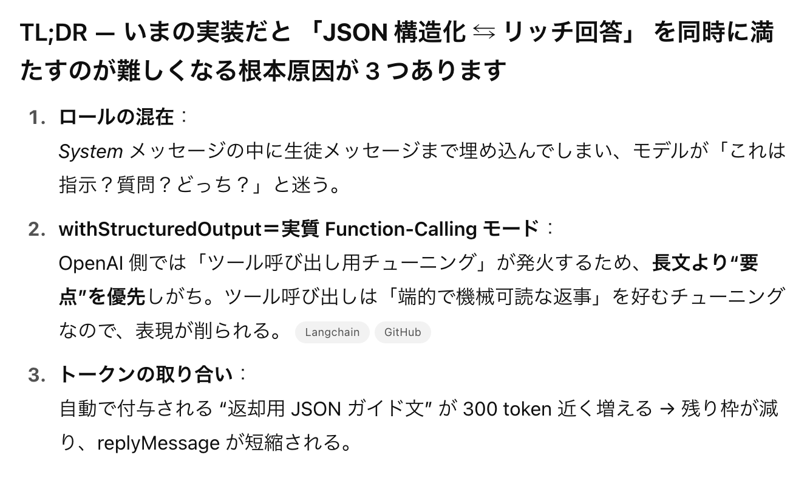

# WAKE Career AI Agent

このリポジトリは 2025/11/18 開催の [ハンズオン】1 時間で作る自作 AI エージェント〜LangChain × LangGraph〜](https://wake-career.connpass.com/event/372312/) で利用するサンプルリポジトリです。

## 免責事項

- 本リポジトリはあくまで手を動かして AI Agent を体験するための手がかりとなるサンプルコードであり、動作や品質を保証しません
- ハンズオン学習用に、ローカル環境で動かすことを想定しています。本番用途に利用しないでください。
- 本リポジトリの内容は予告なく変更されることがあります
- 本リポジトリのコードは全て AI Confing Agent(Codex)で書かれています

## サンプルアプリケーションについて

ローカルで Vite/React フロントと FastAPI バックエンドを並列起動できる最小スキャフォールドです。ステップを追うごとに「プロフィール → 記事/RAG → 求人 → プランニング」と機能が増えていきます。

- `01_bootstrap` → `02_profile_api` → `03_articles_ingest` → `04_recommend_rag` → `05_jobs_and_planning`（＝ルートと同等）の順に機能が積み上がります。
- 各フォルダは「その時点の完成形」を丸ごと持つスナップショットです。**混ぜずに、動かしたいステップを単体で起動**してください。
- 最新機能を一気に見たい人はリポジトリ直下（`backend/`, `frontend/`）を使えば OK です。
- 01_bootstrap からはじめて、少しずつ実装を進めるのも良いでしょう。ディレクトリを切り替えて、動作確認しながら、コードの diff を見るのも良いでしょう。
- もちろんあなただけのオリジナルの AI Agent を作るのも構いません

## 推奨環境

- 対象 OS は macOS または Linux を推奨しています。Windows ネイティブ環境での動作保証は無いため、Windows ユーザは WSL2 上での実行を前提にしてください。
- 現時点（2025/11/19 時点）で動作確認できているのは [GitHub Codespaces](https://github.com/codespaces) と macOS のみです。その他の環境では依存パッケージやパス設定に差異がある可能性があります。

## Setup

### Installation

- Git: macOS は多くの環境で標準。無ければ `xcode-select --install` または https://git-scm.com/downloads からインストール。
  - 確認: `git --version`
- Python 3.11 以上:
  - macOS (Homebrew): `brew install python@3.12`
  - Windows: https://www.python.org/downloads/ で 3.11+ を入れ、「Add Python to PATH」をオン。
  - 確認: `python3 --version`
- uv: Python の依存解決と仮想環境作成をまとめて行うツール。
  - インストール: `curl -LsSf https://astral.sh/uv/install.sh | sh`（macOS/Linux）
  - PowerShell: `irm https://astral.sh/uv/install.ps1 | iex`
  - 確認: `uv --version`
- Node.js 20 以上 / npm 10 以上:
  - macOS (Homebrew): `brew install node@20`
  - 公式: https://nodejs.org/ から LTS (20+) を取得
  - 確認: `node -v` / `npm -v`
- make:
  - macOS: 標準。無ければ `xcode-select --install`
  - Windows: WSL や Git Bash で利用するか `choco install make`
  - 確認: `make -v`

インストールが終われば Quick Start の手順で動作確認してください。

### How to run

#### .env ファイルの用意

```
cp .env.sample .env  # 未作成の場合。OPENAI_API_KEY を含めて編集
```

root の場合完成版が立ち上がります。各ディレクトリにあるステップごとに確認したい場合、該当ディレクトリに移動してください。

```bash
cd 02_profile_api
```

Frontend と Backend 双方で起動してください。

#### バックエンド（FastAPI）

```bash
cd backend
uv sync  # 依存インストールと仮想環境作成
# RAG/求人ステップを触る場合は初回だけベクトルストアを生成
DB_MODE=sqlite uv run python scripts/seed.py
BACKEND_PORT=8089 uv run uvicorn uvicorn_app:app --reload --host 0.0.0.0 --port ${BACKEND_PORT}
```

- `MODE` を `fake` にしておけば OpenAI API キーなしでデモデータを返せます。実運用したい場合は `.env` と同じ値（例: `live`）に揃えてください。
- ポートを変えたい場合は `BACKEND_PORT` と `--port` の値を同じ番号に更新します。
- シードコマンド（`scripts/seed.py`）は `MODE` に応じて FakeEmbeddings or OpenAI Embeddings で `backend/data/vectorstore` を生成します。ライブ環境で高品質なベクトルを作りたい場合は `MODE=live` にし、`.env` へ `OPENAI_API_KEY` を設定してください。
- 02 以前など RAG が不要なステップではシードは不要ですが、`03_articles_ingest` 以降は必ず一度実行してください。
- デフォルトでは `ALLOWED_ORIGINS=["*"]` を許可しています（ローカル/ハンズオン前提）。Codespaces などで Origin を限定したい場合は `.env` で `ALLOWED_ORIGINS='["https://example.com"]'` のように上書きしてください。

#### フロントエンド（Vite + React）

```bash
cd frontend
npm install
VITE_API_BASE=http://localhost:8089 npm run dev -- --host 0.0.0.0 --port 5173
```

- `VITE_API_BASE` はバックエンドの URL に合わせます（例: 上記では `http://localhost:8089`）。ポートを変えた場合はこの値も同期してください。
- `npm run dev` の末尾 `--port` を変えることで 5173 以外のポートでも起動できます。

バックエンドとフロントエンドは別ターミナルで同時に走らせる必要があります。`01_bootstrap` などステップ別スナップショットを動かす場合も、対象ディレクトリ配下の `backend/` と `frontend/` に移動して同じ手順を踏めば OK です。

### GitHub Codespaces を利用する場合

まず repository を fork してください。

uv のみ Install が必要です。ref: https://docs.astral.sh/uv/getting-started/installation/

```
curl -LsSf https://astral.sh/uv/install.sh | sh
```

まず、backend を起動してください

```
cd backend/
uv sync
uv run uvicorn uvicorn_app:app --reload --host 0.0.0.0 --port 8089
```

その後、localhost:8089 にアクセスし、ブラウザに表示された url をメモしてください。

例: `https://crispy-tribble-7gjr4vvgvp2p9w5-8089.app.github.dev`

そして 8089 port を public にしてください。



次に frontend を起動します。最後の起動コマンドの際に、1 つ前に控えた url を入れてください。末尾のスラッシュはないようにしてください。

```
cd frontend
npm install
VITE_API_BASE=https://crispy-tribble-7gjr4vvgvp2p9w5-8089.app.github.dev npm run dev -- --host 0.0.0.0 --port 5173
```

localhost:5173 でアクセスすると動作します。

### 補足

Makefile を使える環境であれば、以下のコマンドで backend / frontend 両方立ち上がります。

```
make dev
```
